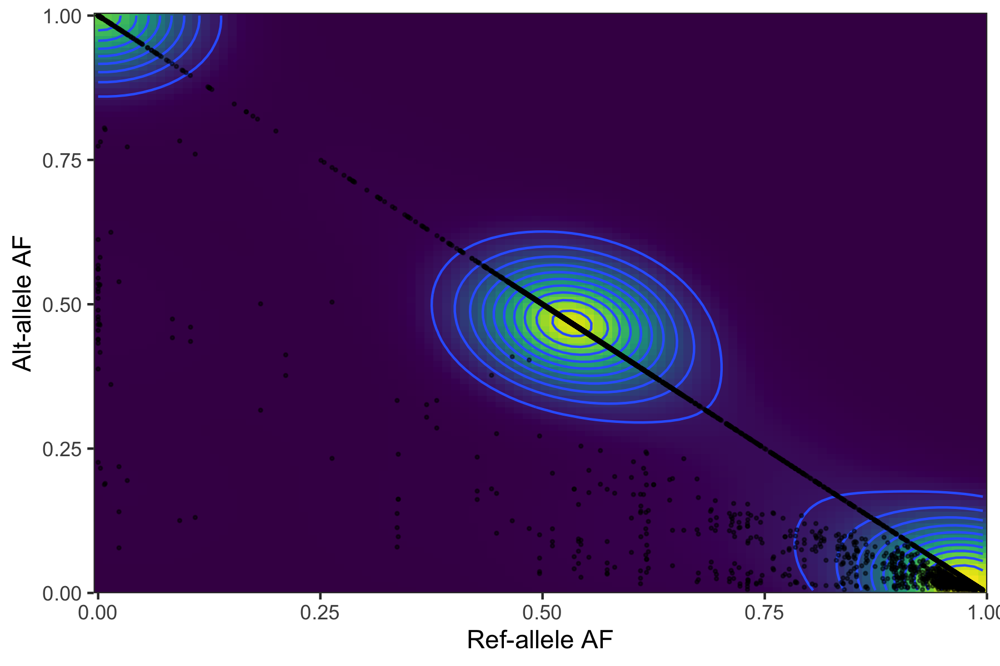
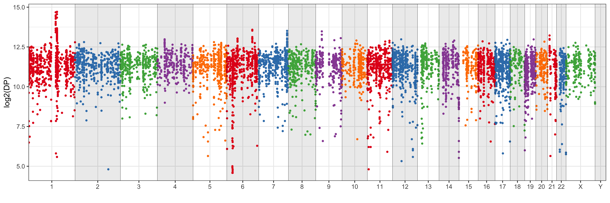

# VCF annotation example

## Instructions

For this challenge, you are asked to prototype a variant annotation tool. We will provide you with
a VCF file, and you will create a small software program to annotate each variant in the file.
Each variant must be annotated with the following pieces of information:
1. Type of variation (substitution, insertion, CNV, etc.) and their effect (missense, silent,
intergenic, etc.). If there are multiple effects, annotate with the most deleterious
possibility.
2. Depth of sequence coverage at the site of variation.
3. Number of reads supporting the variant.
4. Percentage of reads supporting the variant versus those supporting reference reads.
5. Allele frequency of variant from ExAC API (API documentation is available here:
http://exac.hms.harvard.edu/).
6. Any additional annotations that you feel might be relevant.

## Summary

There isn't much to go on in the VCF file. There are two samples included in the file, but it isn't clear what they are, or what the relationship is between them. The fact that there are three genotypes included makes this all the more ambiguous. Because of the differences in samples, the depth and count data is reported per sample. Variant functional annotation and population frequencies are reported as one line for each alternative allele (meaning that for positions with more than one alternative allele, multiple lines will be returned).

The VCF file contains 7569 variants covering 6977 positions across the genome.

### Variant class

    1173 deletions
    776  insertions
    150  multi-base substitutions
    5470 single-base substitutions

### Allele frequencies

The distribution of allele frequencies suggest that there are many (mostly?) germline variants included. 

Normal

VAF5

These allele frequencies look very similar, so this doesn't help to show the difference between the samples. The distribution of GT values (below) also suggests that there isn't much different between the two samples.

### Copy-number alteration

From a genome-wide depth profile, it looks like there is at least one gain in chr1 (1:145273302-152286254, `SETDB1`,`FLG`) and a potential loss on chr6 (6:29910801-31324144, `HLA-B`). Both of these alterations are seen in COSMIC.   

*(w/o a matched normal or panel of normals, it's hard to be more accurate using only DP data from the VCF file)*

Cancer related genes:

Gain

    1	147013182	147098017	BCL9	oncogene, fusion
    1	150782181	150849244	ARNT	oncogene, TSG, fusion
    1	150898815	150937211	SETDB1	oncogene
    1	151030234	151040970	MLLT11	fusion

Loss

    6	29909037	29913661	HLA-A	fusion
    6	31132120	31138470	POU5F1	oncogene, fusion

Of these, a gain in SETDB1 is particularly interesting.

### ExAC frequencies

Many of the variants are not found in the ExAC frequency database. This is a table of the most common populations seen for all variants.

    $ tabl export common_pop out/exac_freq.txt | sort | uniq -c

    4200 (missing)
    737  African
    920  East Asian
    438  European (Finnish)
    489  European (Non-Finnish)
    346  Latino
    90   Other
    349  South Asian

  *(slightly reformatted)*

### Variant function

Here is the breakdown of the 7569 variants, by their functional impact (VEP annotation).

    $ tabl export IMPACT out/VEP_function.txt | sort | uniq -c

    1900 (intergenic)
    55   HIGH
    1179 MODERATE
    1679 LOW
    2756 MODIFIER

  *(slightly reformatted)*

## Methods

### Workflow

I typically will work where I split each task into a separate set of scripts or tools. Then I will merge the appropriate data together after the end. For an HPC cluster, I'll use my own pipeline language (cgpipe) to manage these jobs. For small analyses like this, I'll use a Makefile. All commands needed to build the final output (`out/merged.txt`) is detailed in the Makefile. Some of the inputs require a download and can't be included in this repository (ex: COSMIC tables).

### Variant type

Each variant was assigned a type (deletion, insertion, single-base substitution, or multi-base substitution) based on a comparison to the reference. Any alt-allele that was larger than the reference was considered an insertion. Any alt-allele that was smaller than the reference was considered a deletion. Any alt-allele that was the same length as the reference allele and contained only one difference was a single-base substitution. Alt-alleles with multiple changes, but the same length as the reference allele were multi-base substitutions. This ignores the possibility of an indel/substitution combination.

### Variant functional annotation

Of these instructions, the first is the most difficult. Substitution and indel annotations can be determined from the alterations in the VCF file. For type of variant and effect, there is some information in the VCF file, but for a more comprehensive look at effect, and outside annotation source is required. For this, I typically use the VEP tool from Ensembl. Until working with the ExAC API, I didn't know that they included VEP annotations in their output. However, I'm not sure how much of the VEP information they return, especially with multiple transcripts, so I'm going to re-annotate the file with VEP manually.

VEP annotations were performed by uploading the file to the GRCh37 Ensembl server. In production use, I typically do this using the command-line version of VEP, but I didn't have this setup for GRCh37, so instead I used the online submission tool.

Annotated data was then downloaded in VCF format. Individual annotations for each alternative allele were extracted from the VEP VCF annotation file and reformatted using a Python script. For variants with multiple possible functions (multiple transcripts), functional annotations were prioritized using the IMPACT field (`HIGH > MODERATE > LOW > MODIFIER`) for any `protein_coding` transcripts.

### Allele frequency statistics

Depth and allele frequency statistics can be pulled directly from fields in the VCF file. Depth is encoded in the DP INFO field and allele counts (ref and alt-allele) are encoded in the RO and AO FORMAT fields, respectively. These values were extracted using the `ngsutilsj vcf-export` and `ngsutilsj vcf-tocount` commands. Summary percentage calculations were performed using a python script. Note: When there are multiple alt-alleles for a position, the ref_pct and the alt_pct values may not add up to 1.0. 

Also, it's slightly unclear if the DP value is the real depth here. If the normal and vaf5 samples are related, DP will be inaccurate. The calculated total from `ngsutilsj vcf-tocount` is also included for completeness.

### Population frequency

To annotate each allele with population frequency, it was requested to use the ExAC API. I normally pull this information in with a VEP plugin, or by using the `ngsutilsj vcf-annotate` command to annotate the data directly using a downloaded ExAC VCF file. In production, either of these methods would be preferable for scalability, data protection, and data versioning reasons.

But, in this case, the population frequency information was obtained from the requested ExAC HTTP API using a Python script. The overall allele frequency as well as allele frequencies across all included populations was also captured.

### Copy-number alteration

Copy-number alteration was examined using the genome-wide profile of depth (DP). This was done by plotting the depth of each variant across the genome. Changes in depth across a region are an indication of likely changes in copy number (this assumes uniform coverage across all capture regions). Without more information about the capture regions or expected coverage, I looked for areas of gain/loss by eye. Two regions were identified: 

* Gain: 1:145273302-152286254
* Loss: 6:29910801-31324144

Cancer related genes in this region were extracted from the COSMIC gene list.  The primary COSMIC gene list was preprocessed so that it could be TABIX indexed. This then lets us easily query for the genes present in specific regions (like the gain and loss regions above). It also lets us use this gene list to annotate a VCF file using `ngsutilsj vcf-annotate`.

### Merging data

Because all of the data has been transformed to be in the format of (tab-delimited):

    chrom, pos, ref, alt, value1, value2, ...

With only one alt-allele allowed per line, these data can be combined easily. This merge was performed using a custom python script, but would be a good candidate for writing as a module for the tabl program.

>*Note: I also manually verified that the (chrom, pos, ref, alt) values were in consistent order across all files*

## Working thoughts / observations

Notes about the VCF file:

1. This is an hg19 (`##reference=/data/human_g1k_v37.fasta`) VCF file generated from freebayes -- need to keep track of that w.r.t outside annotations

    I'm not all that familiar with the Freebayes fields, but should be able to figure it out from the description fields. The command information is missing, unfortunately.

2. This is missing the AD format field

    * so that will have to be made up from RO/AO fields (FORMAT)
    * not sure what the difference is between RO/AO and PRO/PAO in the INFO fields, but can just use the sample-specific values  
      see: https://github.com/ekg/freebayes/issues/142

3. Two samples: normal and vaf5.

    Usually I'd assume the "normal" is a germline sample and the "vaf5" is a somatic/tumor sample. But without a lot of clarity about what the sample file is (tumor/normal? two germlines?), I'm not sure that assumption is valid.

    Maybe the normal is a normal processing pipeline and VAF5 area variants with an allele frequency of > 5%? or < 5%? 

    Probably best to treat them completely separately, even if they aren't likely to be independent samples (the counts are too consistent b/w them).

4. Female sample (no Y) 

5. The alt field has multiple variants. So, we'll ultimately want to write a separate line for each in the output file (TSV).

6. This is a triploid sample? The 3 GT fields is odd to me... I'm not sure what to make of that. Is this for the two germline alleles and then the tumor is the third?

        [18:34:41] macmini-mb:~/Projects/TempusTakehome mbreese$ ngsutilsj vcf-export --format GT data/Challenge_data.vcf  | tabl --max 10 view | head
        chrom    | pos       | ref        | alt        | normal:GT  | vaf5:GT    
        =========+===========+============+============+============+============
        1        | 931393    | G          | T          | 0/0/0      | 0/0/0      
        1        | 935222    | C          | A          | 0/1/1      | 0/1/1      
        1        | 1277533   | T          | C          | 1/1/1      | 1/1/1      
        1        | 1284490   | G          | A          | 1/1/1      | 1/1/1      
        1        | 1571850   | G          | A          | 0/0/0      | 0/0/0      
        1        | 1572579   | A          | G          | 0/0/0      | 0/0/0      
        1        | 1575616   | T          | C          | 1/1/1      | 1/1/1      
        1        | 1575784   | C          | T          | 0/0/1      | 0/0/1      

    Summary of values:

        [18:39:35] macmini-mb:~/Projects/TempusTakehome mbreese$ ngsutilsj vcf-export --format GT data/Challenge_data.vcf  | grep -v '^#' | awk '{print $5,$6}' | sort | uniq -c
        2117    0/0/0    0/0/0
        2       0/0/0    0/0/1
        2642    0/0/1    0/0/1
        13      0/0/2    0/0/2
        1       0/0/3    0/0/3
        386     0/1/1    0/1/1
        5       0/1/2    0/1/2
        1788    1/1/1    1/1/1
        7       1/1/2    1/1/2
        16      1/2/2    1/2/2

   From this, it looks like there are only 2 somatic variants? (0/0/0 =>0/0/1) Also, there is one variant where there are 3 alt-alleles given (0/0/3). The 0/0/3 sample is in a homopolymer run

        TAAAAAAAAAAAG (ref) -> 
        TAAAAAAAAAAG
        TAAAAAAAAAG
        TAAAAAAAAAAAAG
        TAAAAAAAAAAAAAG

    Summary of 0/1/2:

        [18:52:50] macmini-mb:~/Projects/TempusTakehome mbreese$ grep '^#\|0/1/2' data/Challenge_data.vcf | ngsutilsj vcf-export --format 'GT' --format '?O' - | tabl view
        chrom    | pos       | ref           | alt                         | normal:GT    | vaf5:GT    | normal:RO    | normal:AO    | vaf5:RO    | vaf5:AO    
        =========+===========+===============+=============================+==============+============+==============+==============+============+============
        1        | 146527270 | CG            | CAA,CA                      | 0/1/2        | 0/1/2      | 308          | 94,77        | 308        | 94,77      
        1        | 150849071 | ACCCCCCCCCCCA | ACCCCCCCCCCA,ACCCCCCCCCCCCA | 0/1/2        | 0/1/2      | 35           | 67,31        | 35         | 67,31      
        6        | 136599391 | CGG           | TGC,CGC                     | 0/1/2        | 0/1/2      | 3325         | 1108,1451    | 3325       | 1108,1451  
        10       | 285477    | TTGT          | TTGTGTT,TTGTGTTT            | 0/1/2        | 0/1/2      | 123          | 337,213      | 123        | 337,213    
        15       | 63363401  | CG            | CATTTTG,CA                  | 0/1/2        | 0/1/2      | 452          | 376,104      | 452        | 376,104    

    So, these are on 1, 6, 10, and 15. 

Other notes: 

1. ExAC has VEP annotations... didn't know that. I normally go the other way round -- use VEP and include ExAC/gnomAD allele frequencies...

    ExAC is also in hg19. This is also good to know. (`##reference=file:///seq/references/Homo_sapiens_assembly19/v1/Homo_sapiens_assembly19.fasta`)

## External data / links

* VEP  
http://grch37.ensembl.org/info/docs/tools/vep/index.html
* ExAC  
https://storage.googleapis.com/gnomad-public/legacy/exac_browser/ExAC.r1.sites.vep.vcf.gz
* COSMIC
Cancer genes: https://cancer.sanger.ac.uk/cosmic/file_download/GRCh37/cosmic/v91/cancer_gene_census.csv  
Coding variants: https://cog.sanger.ac.uk/cosmic/GRCh37/cosmic/v91/VCF/CosmicCodingMuts.normal.vcf.gz

*Note: these links may require a commercial license to use, and thus may not be applicable to other analyses*

Some of the other software I've used here (and personally written):

* Tabl: Working with tab-delimited files for viewing / sorting (Go)  
https://github.com/mbreese/tabl
* ngsutilsj: General NGS workhorse set of tools. In particular here I'm using the Tab/VCF annotation/exporting tools (Java)  
https://github.com/compgen-io/ngsutilsj

For some more information on these tools, check: https://compgen.io

Other software:
* bgzip, tabix from the [HTSlib/Samtools suite](http://www.htslib.org/)

